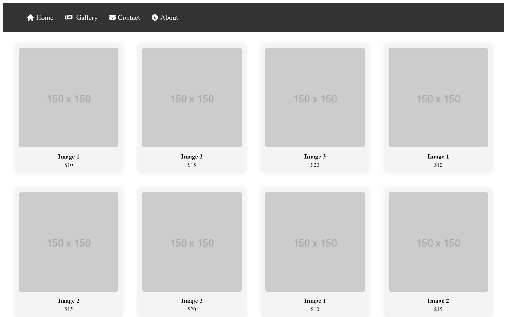
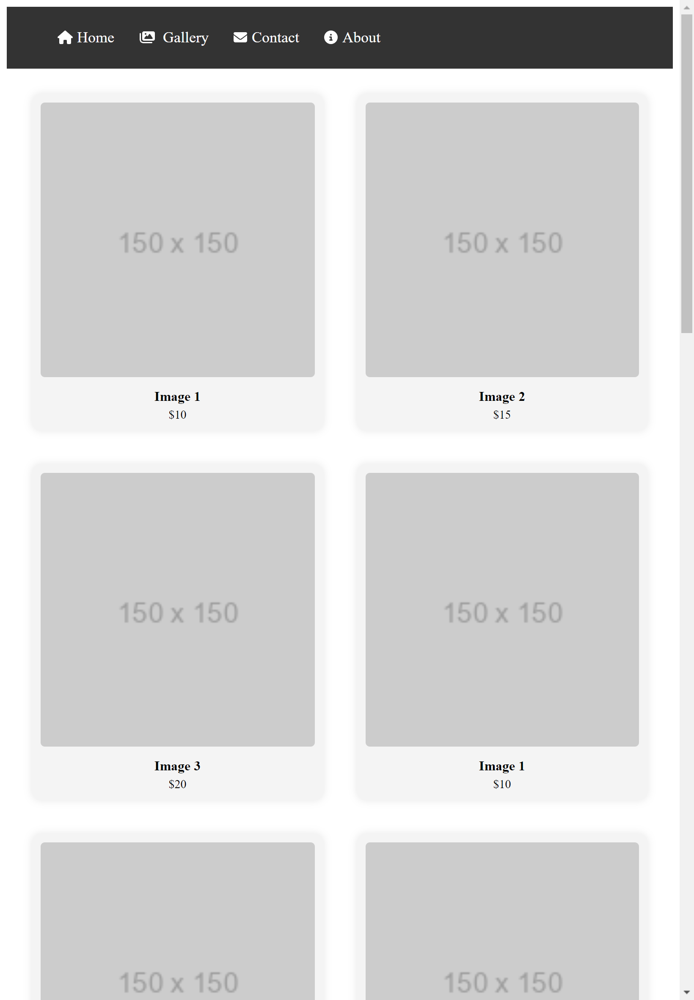
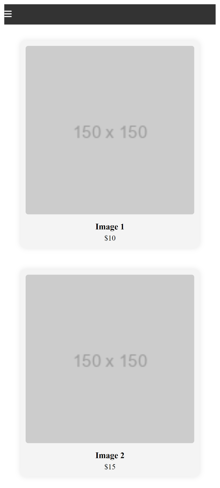
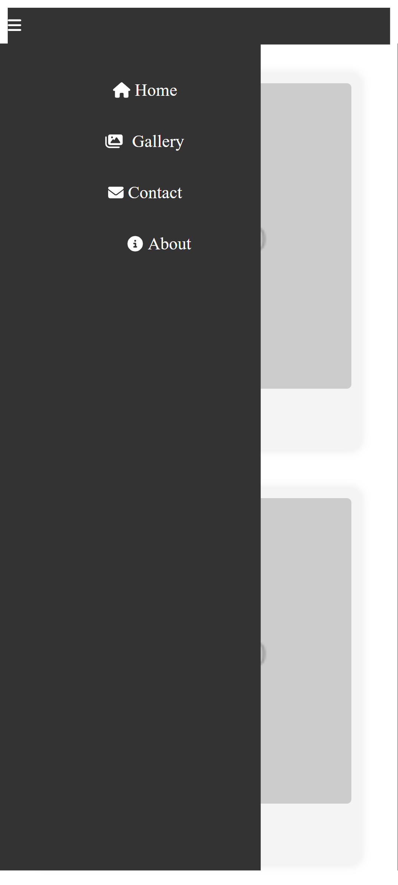

# Responsive Image Gallery with React

This project is a responsive image gallery built with React. It includes a navbar component and a gallery component that adjusts its layout based on different screen sizes.

## Overview

The project consists of the following components:

- **Navbar Component**: A responsive navigation bar with links such as Home, Gallery, Contact, and About. It includes a hamburger icon for smaller screens and a dropdown list for navigation items.

- **ImageCard Component**: Represents each image in the gallery. It includes an image, a title, and a price. The cards have a hover effect for better interaction.

- **Gallery Component**: Displays a grid of ImageCard components. The layout adjusts to different screen sizes using CSS Grid for responsiveness.

## How to Run Locally

To run this project locally, follow these steps:

1. Clone the repository:

   ```bash
   git clone https://github.com/your_username/responsive-image-gallery.git
   ```

2. Navigate to the project directory:

   ```bash
   cd responsive-image-gallery
   ```

3. Install dependencies:

   ```bash
   npm install
   ```

4. Start the development server:

   ```bash
   npm start
   ```

5. Open your browser and go to `http://localhost:3000` to view the application.

## Screenshots

### Large Screen


### Medium Screen


### Small Screen



## Technologies Used

- React
- CSS (including CSS Grid for layout)
- Font Awesome for icons

## Credits

This project was created by [Your Name]. Feel free to contribute or provide feedback!
